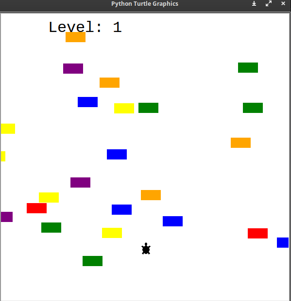
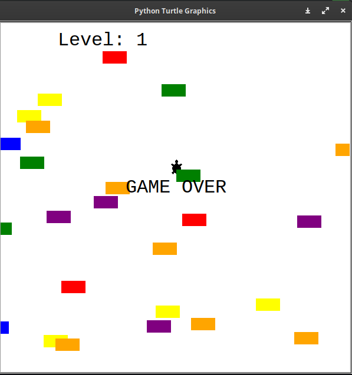

# Turtle Crossing Game

We have a whole bunch of cars going across super busy multi-lane highway and turtle is the player who has to cross the road.

## Features
A player control the turtle which can only go forward, and the whole buh of randomly generated car going horizontally on the screen.
Now, Once a player reaches the otherside of the screen, the cars speed up and level increased, but the player goes back to the starting position, ready to cross the road again. When at 
the same point turtle hits the car, then that is game over.

## How to Run

1. A turtle moves forwards when you press the "Up" key. It can only move forwards, not back, left or right.
2. Cars are randomly generated along the y-axis and will move from the right edge of the screen to the left edge.
3. When the turtle hits the top edge of the screen, it moves back to the original position and the player levels up. On the next level, the car speed increases.
4. When the turtle collides with a car, it's game over and everything stops.
   ```bash
   python main.py

## Screenshot
This is what a gameplay look a like.



